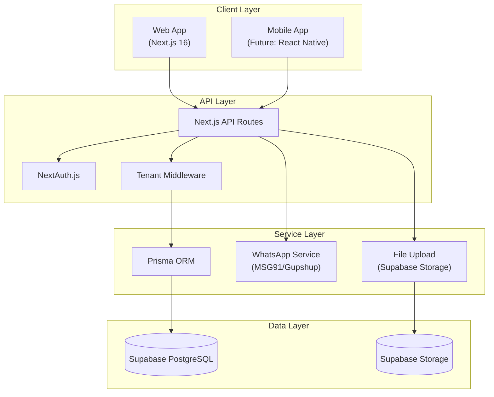
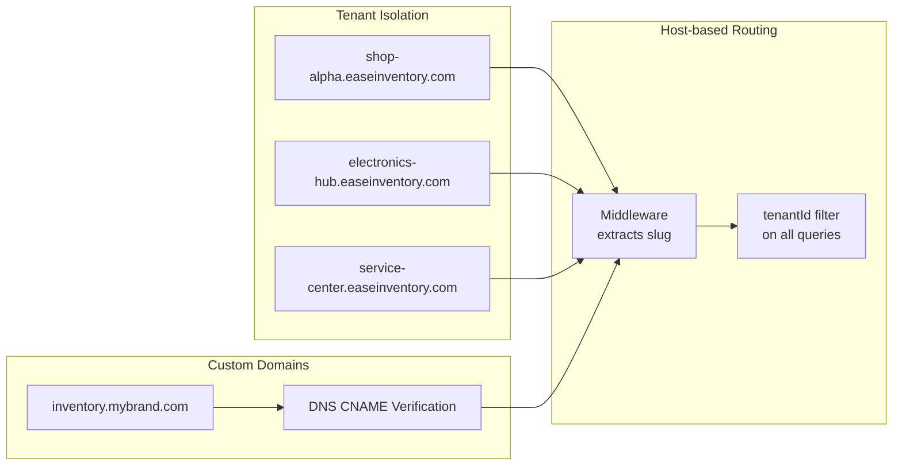
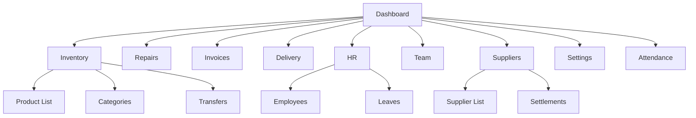
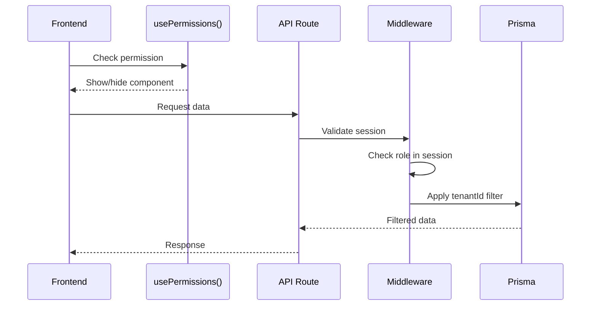
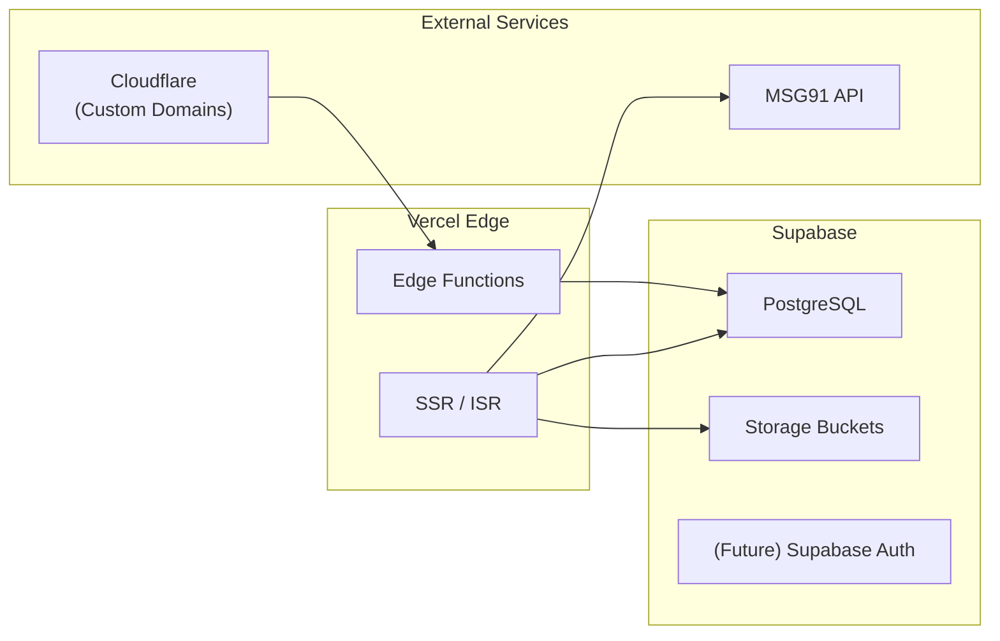

# EaseInventory - System Architecture

> **Last Updated**: January 27, 2026  
> **Version**: 1.0 (Post-MVP)

---

## System Overview

---

## Multi-Tenant Architecture

---

## API Route Structure

| Category | Endpoint | Methods | Description |
|----------|----------|---------|-------------|
| **Auth** | `/api/register` | POST | Multi-tenant registration |
| **Auth** | `/api/check-slug` | GET | Subdomain availability |
| **Auth** | `/api/auth/[...nextauth]` | * | NextAuth handlers |
| **Onboarding** | `/api/onboarding` | POST | KYC document submission |
| **Users** | `/api/users` | GET, POST | Team roster management |
| **Users** | `/api/users/[id]` | PUT, DELETE | User updates |
| **Products** | `/api/products` | GET, POST | Inventory catalog |
| **Inventory** | `/api/inventory` | GET | Stock overview |
| **Inventory** | `/api/inventory/locations` | GET, POST | Multi-location support |
| **Inventory** | `/api/inventory/transfers` | GET, POST, PATCH | Inter-site transfers |
| **Deliveries** | `/api/deliveries` | GET | Dispatch tracking |
| **Repairs** | `/api/repairs` | GET, POST, PATCH | Service center tickets |
| **Repairs** | `/api/repairs/[id]` | GET, PATCH | Ticket details |
| **Invoices** | `/api/invoices` | GET, POST | Financial billing |
| **Invoices** | `/api/invoices/[id]` | GET, PATCH | Invoice details |
| **Invoices** | `/api/invoices/export/gstr1` | GET | GST compliance export |
| **HR** | `/api/hr/employees` | GET, POST | Employee roster |
| **HR** | `/api/hr/attendance` | GET, POST | Punch in/out |
| **HR** | `/api/hr/leaves` | GET, POST, PATCH | Leave management |
| **HR** | `/api/hr/payroll/calculate` | POST | Salary engine |
| **Suppliers** | `/api/suppliers` | GET, POST | Vendor directory |
| **Suppliers** | `/api/suppliers/[id]` | GET, PATCH | Supplier details |
| **Settlements** | `/api/settlements` | GET, PATCH | Consignment payouts |
| **Tenant** | `/api/tenant/settings` | GET, PATCH | Domain/branding config |
| **Public** | `/api/public/[slug]` | GET | Public tenant pages |

---

## Dashboard Module Map

---

## Security & RBAC

### Predefined Roles

| Role | Permissions |
|------|-------------|
| **OWNER** | Full access to all modules |
| **MANAGER** | All operations except tenant settings |
| **ACCOUNTANT** | Invoices, Repairs (cost finalization), GSTR-1 |
| **TECHNICIAN** | Repairs (diagnosis, notes, parts) |
| **SALES_STAFF** | Inventory, Invoices, Deliveries |
| **VIEWER** | Read-only access to all modules |
| **STAFF** | Limited inventory and delivery access |

### Implementation

---

## Tech Stack Summary

| Layer | Technology |
|-------|------------|
| **Frontend** | Next.js 16, React, HeroUI, Framer Motion |
| **Styling** | CSS Modules, Tailwind (optional) |
| **State** | React Hooks, Server Components |
| **API** | Next.js Route Handlers |
| **Auth** | NextAuth.js v5 |
| **ORM** | Prisma (PostgreSQL) |
| **Database** | Supabase PostgreSQL |
| **Storage** | Supabase Storage |
| **Messaging** | MSG91 / Gupshup (WhatsApp) |
| **QR Codes** | qrcode.react |
| **Charts** | (To be added) |

---

## Deployment Architecture

