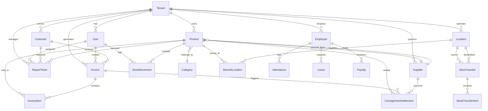

# EaseInventory - Data Model Reference

> **Last Updated**: January 27, 2026  
> **Database**: Supabase PostgreSQL  
> **ORM**: Prisma v7.3

---

## Entity Relationship Diagram



---

## Core Models Summary

### Multi-Tenant Foundation

| Model | Purpose | Key Fields |
|-------|---------|------------|
| **Tenant** | Business workspace | `slug`, `customDomain`, `gstNumber`, `plan` |
| **User** | Staff accounts | `email`, `role`, `tenantId`, `permissions` |
| **Account** | OAuth providers | NextAuth adapter |
| **Session** | Active sessions | NextAuth adapter |

### Inventory & Products

| Model | Purpose | Key Fields |
|-------|---------|------------|
| **Category** | Product taxonomy | `name`, `parentId` (hierarchical) |
| **Product** | Stock items | `sku`, `costPrice`, `salePrice`, `quantity`, `hsnCode` |
| **Supplier** | Vendor directory | `gstNumber`, `bankAccount` |
| **StockMovement** | Audit trail | `type`, `quantity`, `productId`, `userId` |
| **Location** | Warehouses/stores | `name`, `code`, `type` |
| **StockAtLocation** | Multi-location stock | `productId`, `locationId`, `quantity` |
| **StockTransfer** | Inter-site moves | `sourceLocationId`, `destLocationId`, `status` |
| **StockTransferItem** | Transfer line items | `productId`, `quantity` |
| **ConsignmentSettlement** | Vendor payouts | `payoutAmount`, `status` |

### Customer & Invoicing

| Model | Purpose | Key Fields |
|-------|---------|------------|
| **Customer** | Client records | `phone`, `gstNumber`, `companyName` |
| **Invoice** | Bills | `invoiceNumber`, `total`, `paymentStatus`, `status` |
| **InvoiceItem** | Line items | `description`, `hsnCode`, `taxRate` |

### Repairs & Service

| Model | Purpose | Key Fields |
|-------|---------|------------|
| **RepairTicket** | Service jobs | `ticketNumber`, `status`, `diagnosis`, `totalCost` |

### HR & Attendance

| Model | Purpose | Key Fields |
|-------|---------|------------|
| **Employee** | Staff records | `employeeId`, `designation`, `baseSalary` |
| **Attendance** | Punch log | `checkIn`, `checkOut`, `checkInLat/Lng` |
| **Leave** | Time-off requests | `leaveType`, `status`, `approvedBy` |
| **Holiday** | Company holidays | `date`, `isOptional` |
| **Payslip** | Monthly salary | `netSalary`, `workingDays`, `presentDays` |

---

## Enums Reference

### User Roles
```
SUPER_ADMIN | OWNER | MANAGER | ACCOUNTANT 
TECHNICIAN | SALES_STAFF | VIEWER | STAFF
```

### Business Types
```
SHOP | COMPANY | SERVICE_CENTER | WAREHOUSE | DISTRIBUTOR
```

### Plan Types
```
FREE | STARTER | BUSINESS | ENTERPRISE
```

### Payment
```
PaymentMode: CASH | CARD | UPI | BANK_TRANSFER | CHEQUE | CREDIT
PaymentStatus: PENDING | PARTIAL | PAID | OVERDUE | REFUNDED
InvoiceStatus: DRAFT | SENT | PAID | CANCELLED
```

### Repair
```
RepairStatus: RECEIVED | DIAGNOSED | WAITING_APPROVAL | WAITING_PARTS 
              | IN_REPAIR | QUALITY_CHECK | READY | DELIVERED | CANCELLED
RepairPriority: LOW | MEDIUM | HIGH | URGENT
```

### Stock
```
MovementType: PURCHASE | SALE | RETURN_IN | RETURN_OUT | ADJUSTMENT 
              | TRANSFER | DAMAGE | REPAIR_IN | REPAIR_OUT
TransferStatus: PENDING | IN_TRANSIT | COMPLETED | CANCELLED
```

### HR
```
AttendanceStatus: PRESENT | ABSENT | HALF_DAY | LATE | ON_LEAVE | HOLIDAY
LeaveType: CASUAL | SICK | EARNED | UNPAID | MATERNITY | PATERNITY
LeaveStatus: PENDING | APPROVED | REJECTED | CANCELLED
PayrollStatus: DRAFT | GENERATED | PAID | CANCELLED
```

---

## Indexes & Constraints

### Primary Indexes
- All models: `tenantId` (multi-tenant isolation)
- `Product`: `serialNumber`, `barcode`
- `Invoice`: `invoiceNumber`  
- `RepairTicket`: `ticketNumber`, `customerId`
- `Attendance`: `date`
- `Customer`: `phone`

### Unique Constraints
- `Tenant`: `slug`, `customDomain`
- `User`: `email` (global), `[email, tenantId]` (tenant-scoped)
- `Product`: `serialNumber`, `[slug, tenantId]`
- `Employee`: `[employeeId, tenantId]`
- `Attendance`: `[employeeId, date]`
- `Payslip`: `[employeeId, month, year]`
